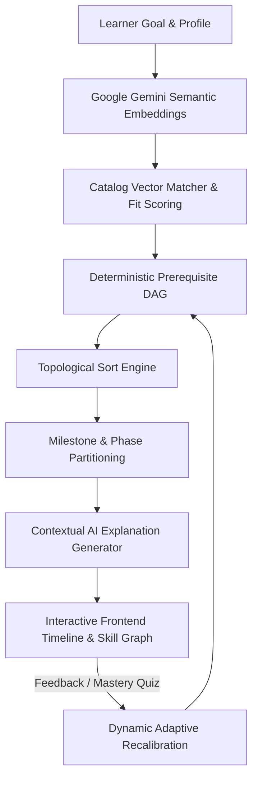

# PathWise 🗺️ — AI-Powered Personalized Career & Learning Path Recommender

> **Production-Grade, Hackathon-Winning Build**  
> Empirically grounded in learning research: Directed Acyclic Graph (DAG) prerequisite sequencing + Google Gemini AI.

---

## 🌟 Key Highlights & Core Differentiators

* **🧠 Hybrid Recommendation Engine:** Combines vector semantic matching with deterministic topological sorting on a skill graph DAG. Zero prerequisite hallucinations.
* **⚡ Visible Adaptive Recalibration:** Feedback (*Too Hard*, *Too Easy*) triggers dynamic re-ranking with live AI-written narration.
* **📝 Mastery Checks, Not Self-Report:** Every milestone is gated by interactive mini-assessments to verify genuine skill retention before advancing.
* **🌟 Deliberate Serendipity Injection:** Curates multidisciplinary wildcard resources (e.g., UX Accessibility for Frontend developers) to broaden problem-solving capability.
* **🕸️ Interactive Skill Graph (DAG):** Visualizes prerequisite hierarchies, mastery status, and labor market hiring demand indicators.
* **📜 Shareable Mastery Portfolio:** Auto-generates a recruiter-ready competency portfolio page suitable for LinkedIn sharing.
* **💬 Grounded AI Career Coach:** A persistent, conversational AI assistant providing adaptive coaching grounded in the learner's active goals and roadmap.

---

## 🏗️ System Architecture



---

## 🤖 Generative AI Configuration (Google Gemini)

PathWise is natively powered by **Google Gemini** (`gemini-2.5-flash`, `gemini-flash-latest`, `gemini-pro-latest`).

To enable live Generative AI responses:
1. Get a **Free Gemini API Key** from [Google AI Studio](https://aistudio.google.com/app/apikey).
2. Add it to your `backend/.env` file:
   ```env
   GEMINI_API_KEY=AIzaSy...your_actual_key_here
   ```
*(Note: If no API key is provided, PathWise gracefully activates its deterministic reasoning fallback engine so the app continues functioning seamlessly).*

---

## 🛠️ Tech Stack

* **Backend:** Java 21, Spring Boot 3.3, Spring Data JPA, Spring Security (JWT + Refresh Tokens), Flyway DB Migrations, Google Gemini v1 API.
* **Database:** Neon Cloud PostgreSQL (Serverless v18.6).
* **Frontend:** React 19, Vite, TypeScript, Tailwind CSS, shadcn/ui.
* **Deployment Ready:** Render (Backend), Vercel / Netlify (Frontend), Neon (Database).

---

## 🚀 Quickstart Guide

### Option 1: Native Run

#### 1. Backend Setup
```bash
cd backend
# On Windows: .\mvnw spring-boot:run
./mvnw spring-boot:run
```
* Backend starts at `http://localhost:4444` (Swagger UI at `http://localhost:4444/swagger-ui.html`).

#### 2. Frontend Setup
```bash
cd frontend
npm install
npm run dev
```
* Frontend starts at `http://localhost:5173`.

---

## 📚 Complete Documentation Suite
* [Problem Statement & 16 Research Solutions](docs/PROBLEM_STATEMENT.md)
* [Competitive Analysis & Gaps vs. Coursera / Degreed / roadmap.sh](docs/COMPETITIVE_ANALYSIS.md)
* [Deep Architectural Specification](docs/ARCHITECTURE.md)
* [Design Decisions & Trade-Offs](DECISIONS.md)
* [Step-by-Step Deployment Guide](HELP.md)
* [Verification & Test Results](VERIFICATION.md)
